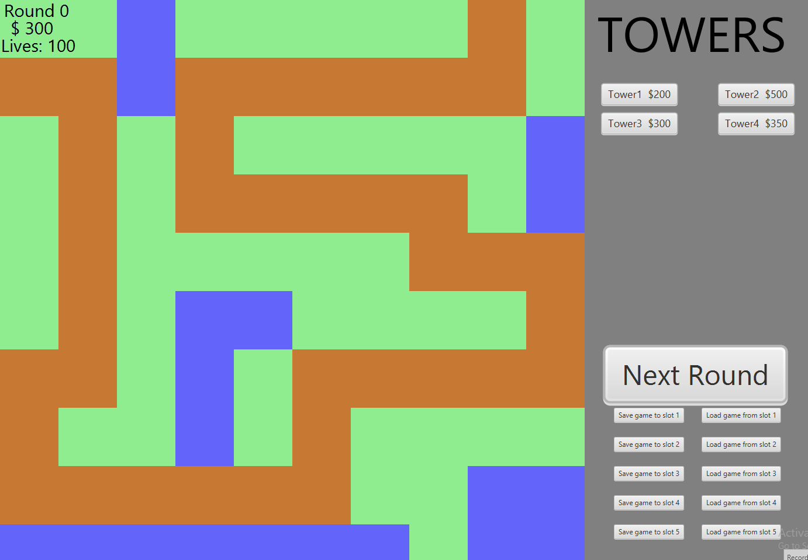
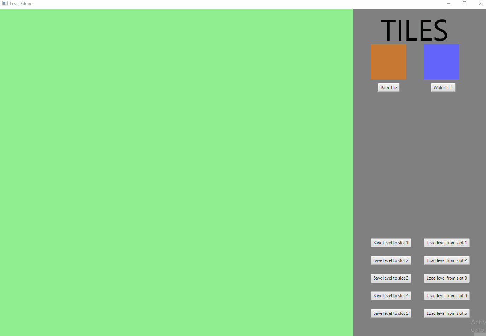

# TowerDefense

### How to run this project 

- Install a scala compiler version 11 or later. (if not already installed)
- Navigate to the root directory
- There run: sbt run
- Press "1" for the game, "2" for the level editor 
  
### How to play

#### Game

Select a prebuilt level by loading a game from any slot. There are example levels on slots 1-3. Slot 1 is loaded by default. To buy a tower, click on a tower button on the right, then somewhere on the map where there is room (green tile). To upgrade or sell a tower, click on it, then click on the menu on the right. 'Esc' -button deselects selected towers. 'Next round' button advances to the next round. The current game can be saved to any of the five save slots and loaded later with the buttons below 'Next Round'.

#### Level editor

Select a tile from the menu on the right. To deselect, press 'Esc'. Click on the map to place the tile. In order for the level to work, there needs to be a continous path of path tiles from start to finish. To set the start/finish properties of a path tile, click on it. Then you can make the tile a start/end tile or remove those properties. To save the level, press 'Save level to slot'. Saving to a slot will overwrite any previous saves/levels. To play this level, start the game and load the appropriate slot.

#### Features

- 3 kinds of enemies, one spawns more on death
- 4 unique towers with 4 upgrades each
- Automatic round generator
- Level editor and game saving

